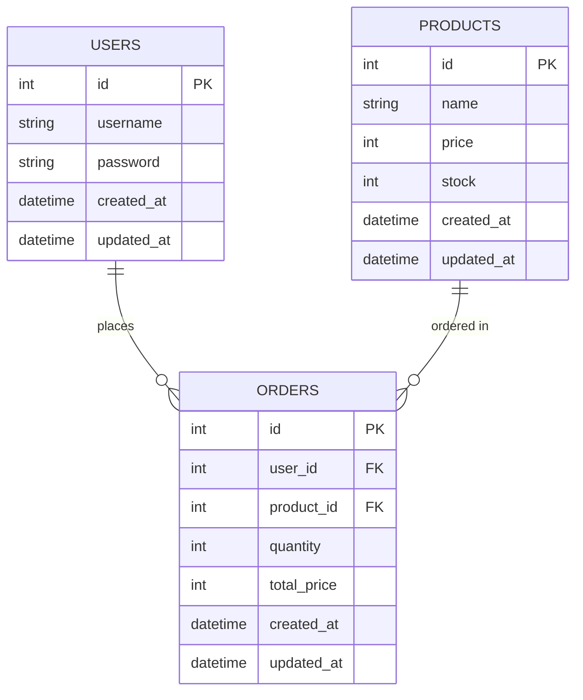

# 🚀 UTS: Pengembangan Aplikasi Web (Refactoring ke MVC)

*Nama:* Abdul Rohman  
*NIM:* 25120100051

---

## 🌱 1. Profil Startup

### 📌 Nama Startup
Kepul Lite

### ❗ Problem yang Diselesaikan
Banyak masyarakat memiliki sampah daur ulang seperti plastik, kardus, dan botol, namun tidak tahu cara menjualnya atau merasa repot untuk mengelolanya.

Akibatnya, sampah sering dibuang sembarangan dan mencemari lingkungan.

### 🎯 Target Pengguna
- Masyarakat rumah tangga
- UMKM (cafe, restoran, toko)
- Individu yang peduli lingkungan

---

## 🧩 Deskripsi Aplikasi
Kepul Lite adalah aplikasi web sederhana yang memungkinkan pengguna untuk melihat daftar jenis sampah yang bisa dijual beserta harganya, serta melakukan simulasi pembelian/penjualan sampah.

---

## ⚙️ Fitur Prototipe
- Login & Logout user
- Dashboard setelah login
- Menampilkan daftar sampah daur ulang
- Simulasi "jual" sampah (mengurangi stok)
- Proteksi halaman (harus login dulu)

---

## 📝 2. Penjelasan Fitur JavaScript (DOM)

Saya membuat fitur CRUD (Create, Read, Update, Delete) lengkap untuk manajemen sampah daur ulang menggunakan JavaScript ES6 Classes dan Local Storage:

- **Create**: Form untuk menambah jenis sampah baru dengan validasi input
- **Read**: Tabel responsif yang menampilkan semua data sampah dengan styling Bootstrap
- **Update**: Modal edit untuk mengubah data sampah yang ada
- **Delete**: Konfirmasi hapus dengan filter array
- **Sell**: Fitur simulasi penjualan yang mengurangi stok secara real-time

Fitur ini menggunakan DOM Manipulation intensif dengan event listeners, template literals untuk rendering, dan Local Storage untuk persistensi data tanpa database.
---

## 🔐 Sistem Autentikasi & Session Management

### Fitur Login Dasar
- **Form Login**: Interface responsif dengan Bootstrap 5
- **Validasi Credentials**: Dummy authentication (admin/bisnis123)
- **Error Handling**: Flash messages untuk feedback user
- **Session Management**: CodeIgniter 4 session dengan regenerate ID

### Proteksi Halaman
- **Auth Filter**: Middleware untuk route protection
- **Auto Redirect**: User tidak login diarahkan ke halaman login
- **Session Check**: Validasi session di setiap request protected
- **Logout**: Destroy session dan redirect ke login

### Keamanan Session
- **Session Regenerate**: Mencegah session fixation attacks
- **Secure Storage**: Server-side session storage
- **Flash Messages**: Temporary messages untuk user feedback
- **Exception Handling**: Logging untuk debugging
---

## 🗂️ 3. Perancangan Basis Data

Untuk persiapan skala dan database SQL, berikut struktur data yang dirancang untuk Kepul Lite:

- **Users**: Menyimpan akun user/admin.
- **Products**: Menyimpan jenis sampah/produk yang dijual.
- **Orders**: Menyimpan transaksi penjualan sampah.

### Relasi Antar Tabel
- **Users 1 — N Orders**: satu user dapat membuat banyak transaksi.
- **Products 1 — N Orders**: satu jenis sampah dapat muncul di banyak transaksi.

### Kontrak PK / FK
- `Users.id` adalah PK pada tabel Users.
- `Products.id` adalah PK pada tabel Products.
- `Orders.id` adalah PK pada tabel Orders.
- `Orders.user_id` adalah FK yang merujuk ke `Users.id`.
- `Orders.product_id` adalah FK yang merujuk ke `Products.id`.

### ERD

---

## 🎨 UI/UX Features

### Responsive Design
- **Bootstrap 5**: Framework CSS untuk layout responsif
- **Mobile-First**: Design yang optimal di semua device
- **Gradient Backgrounds**: Visual appeal dengan CSS gradients
- **Card Layout**: Modern card-based interface

### Interaktivitas
- **Real-time Updates**: Perubahan stok langsung terlihat
- **Form Validation**: Client-side validation untuk input
- **Modal Dialogs**: Smooth edit experience dengan Bootstrap modals
- **Color Coding**: Stok rendah ditandai merah, normal hijau

### CRUD Operations
- **Create**: Tambah sampah baru via form
- **Read**: Tampilkan semua data dalam tabel sortable
- **Update**: Edit data melalui modal popup
- **Delete**: Hapus dengan konfirmasi
- **Sell**: Simulasi transaksi penjualan

### Fitur Jual Sampah
- **Database Harga Fixed**: 5 jenis sampah dengan harga tetap per kg
- **Dropdown Pilihan**: Botol Plastik (Rp 1.000/kg), Minyak Jelantah (Rp 5.000/kg), dll.
- **Kalkulasi Otomatis**: Input kg → harga total langsung terhitung
- **Transaksi Sederhana**: Klik "Jual" untuk menyelesaikan transaksi

---

## 💭 4. Refleksi Refactoring

Memisahkan kode ke dalam struktur MVC sangat penting karena:

- **Kerapihan (Organized):**  
  Kode tidak menumpuk dalam satu file seperti pada spaghetti code.

- **Kemudahan Perawatan (Maintenance):**  
  Perubahan tampilan tidak akan mengganggu logika program.

- **Skalabilitas (Scalability):**  
  Memudahkan pengembangan fitur baru di masa depan.

### Penerapan OOP dalam CodeIgniter 4

Dalam refactoring ini, kami menerapkan prinsip Object-Oriented Programming (OOP) sebagai berikut:

1. **Encapsulation**: 
   - Data dan methods disembunyikan dalam class (private methods seperti `validateCredentials`, `isUserLoggedIn`)
   - Properties protected di Model untuk future database integration

2. **Inheritance**: 
   - `Auth` extends `Controller`, `Dashboard` extends `BaseController`
   - `ProductModel` extends `Model` dari CodeIgniter

3. **Polymorphism & Abstraction**: 
   - Interface `ProductInterface` untuk kontrak methods
   - Type hints pada semua methods (string, int, array, ResponseInterface)

4. **Exception Handling**: 
   - Try-catch blocks untuk error handling yang robust
   - Logging errors untuk debugging

5. **Dependency Injection**: 
   - Constructor injection untuk ProductModel di Dashboard

Struktur ini memastikan kode yang maintainable, testable, dan scalable untuk pertumbuhan startup Kepul Lite.
