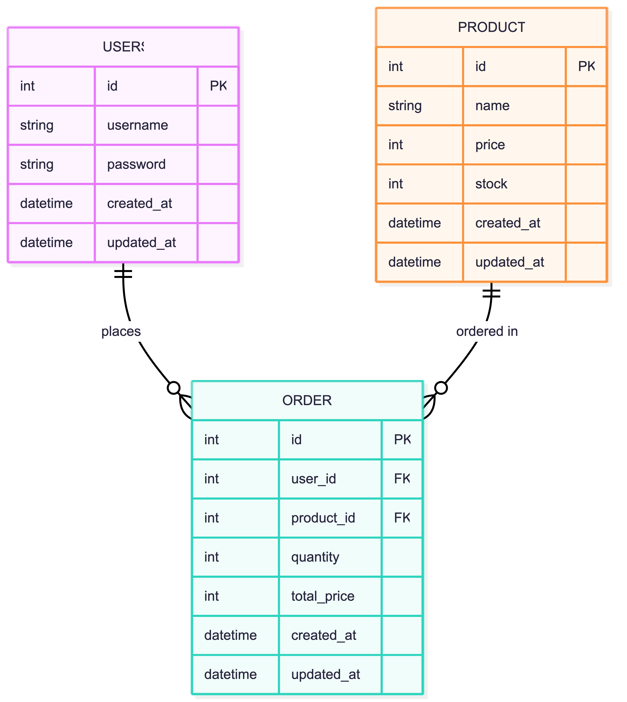

# 🚀 UTS: Pengembangan Aplikasi Web (Refactoring ke MVC)

## ⚠️ PERHATIAN PENTING SEBELUM MENGERJAKAN!
Tujuan utama ujian ini adalah *memperbaiki kode yang berantakan* (Legacy Code) menjadi rapi di dalam framework CodeIgniter 4. 

*ATURAN MAIN:*

1.⁠ ⁠Anda *DILARANG* hanya menyalin data dari file lama

2.⁠ ⁠Anda *WAJIB* menyesuaikan data barang/jasa di dalam Model sesuai dengan *Ide Startup* Anda masing-masing (yang anda tentukan sendiri).

3.⁠ ⁠Jika Startup Anda adalah "Kedai Kopi", maka data yang tampil harus Menu Kopi, bukan "Laptop Pro".

---

## 🛠️ LANGKAH-LANGKAH PENGERJAAN

### Langkah 1: Pahami Masalah (Legacy Code)
Buka folder ⁠`legacy_code/spaghetti.php`⁠. Lihat betapa berantakannya kode tersebut (Spaghetti Code). 

Tugas Anda adalah memindahkan fungsi-fungsinya ke tempat yang benar di folder `app/`.

### Langkah 2: Kelola Data (Model)
•⁠  ⁠Buka `app/Models/ProductModel.php`.

•⁠  ⁠*TUGAS:* Ganti isi array di dalam fungsi `getDummyData()` dengan data yang sesuai dengan bisnis Startup Anda (Minimal 3 data).

•⁠  ⁠Contoh: Jika startup Anda jasa cuci sepatu, maka datanya adalah: `Cuci Deep Clean`⁠, `Un-yellowing`, dll.

### Langkah 3: Logika Login & Logout (Controller Auth)
•⁠  ⁠Buka `app/Controllers/Auth.php`.

•⁠  ⁠Cari tanda `// TODO: TUGAS MAHASISWA!`.

•⁠  ⁠Selesaikan logika proses login dan logout menggunakan Session CodeIgniter 4.

### Langkah 4: Proteksi Halaman (Controller Dashboard)
•⁠  ⁠Buka `app/Controllers/Dashboard.php`.

•⁠  ⁠Cari tanda `// TODO: TUGAS MAHASISWA!`.

•⁠  ⁠Tambahkan kode untuk mengecek apakah user sudah login atau belum. Jika belum login, user tidak boleh bisa melihat dashboard!

### Langkah 5: Interaktivitas (View & JavaScript)
•⁠  ⁠Buka `app/Views/dashboard_view.php`.

•⁠  ⁠Di bagian paling bawah, ada tag `<script>`.

•⁠  ⁠*TUGAS:* Buatlah fitur JavaScript sederhana (DOM Manipulation). Contoh: Ketika tombol "Beli" diklik, jumlah stok di baris tersebut berkurang secara otomatis di layar.

---

## 📝 LEMBAR JAWABAN (WAJIB DIISI)

*Nama:* Abdul Rohman

*NIM:* 25120100051

### 1. Profil Startup
•⁠  ⁠*Nama Startup:* Kepul Lite

•⁠  ⁠*Problem yang Diselesaikan:* Banyak masyarakat memiliki sampah daur ulang seperti plastik, kardus, dan botol, namun tidak tahu cara menjualnya atau merasa repot untuk mengelolanya.

Akibatnya, sampah sering dibuang sembarangan dan mencemari lingkungan.

•⁠  ⁠*Target Pengguna:* 
- Masyarakat rumah tangga
- UMKM (cafe, restoran, toko)
- Individu yang peduli lingkungan

### 2. Penjelasan Fitur JavaScript (DOM)
•⁠  ⁠*Apa yang Anda buat?* Saya membuat fitur CRUD (Create, Read, Update, Delete) lengkap untuk manajemen sampah daur ulang menggunakan JavaScript ES6 Classes dan Local Storage:

- **Create**: Form untuk menambah jenis sampah baru dengan validasi input
- **Read**: Tabel responsif yang menampilkan semua data sampah dengan styling Bootstrap
- **Update**: Modal edit untuk mengubah data sampah yang ada
- **Delete**: Konfirmasi hapus dengan filter array
- **Sell**: Fitur simulasi penjualan yang mengurangi stok secara real-time

Fitur ini menggunakan DOM Manipulation intensif dengan event listeners, template literals untuk rendering, dan Local Storage untuk persistensi data tanpa database.

### 3. Entity Relationship Diagram (ERD)

### 4. Refleksi Refactoring
•⁠  ⁠*Pertanyaan:* Kenapa kita harus memisahkan kode menjadi Model, View, dan Controller (MVC)? Kenapa tidak pakai cara lama seperti di ⁠ spaghetti.php ⁠ saja?

•⁠  ⁠*Jawaban:* Memisahkan kode ke dalam struktur MVC sangat penting karena:

- **Kerapihan (Organized):**  
  Kode tidak menumpuk dalam satu file seperti pada spaghetti code.

- **Kemudahan Perawatan (Maintenance):**  
  Perubahan tampilan tidak akan mengganggu logika program.

- **Skalabilitas (Scalability):**  
  Memudahkan pengembangan fitur baru di masa depan.

---
Kumpulkan tugas dengan cara mengirimkan file zip berisi BWD-MID-STARTER-KIT yang sudah dimodifikasi
